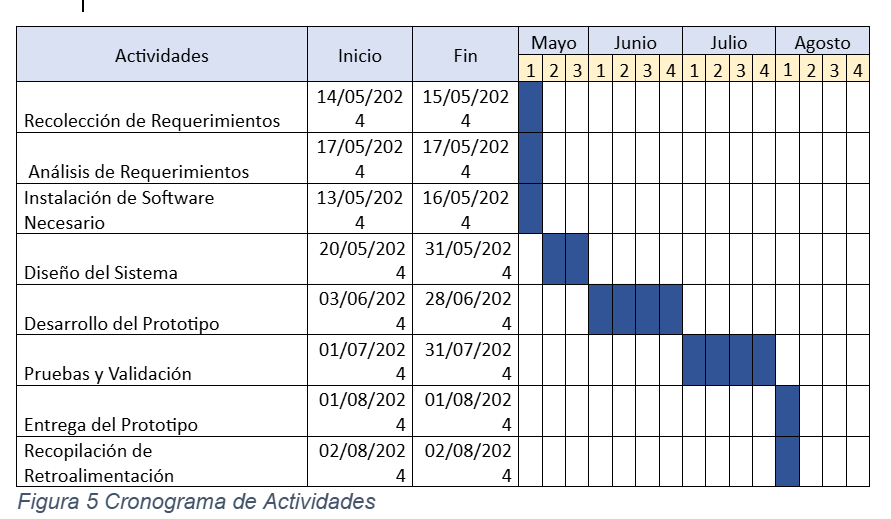

DEDICATORIA 

Dedico este trabajo con todo mi cariño y gratitud a mi familia, cuyo apoyo incondicional ha sido fundamental para el éxito de este proyecto. A mis padres, quiero expresarles mi más profundo agradecimiento. Su constante aliento, comprensión y fe en mis capacidades han sido mi mayor fuente de motivación. Desde el inicio de este proyecto hasta su culminación, su confianza en mí y en mis habilidades ha sido una luz que me ha guiado en los momentos más desafiantes.

A mis hermanos, les agradezco por su comprensión y apoyo incondicional, que han hecho que el camino hacia esta meta sea más llevadero. Su disposición para escuchar y su constante ánimo han sido un pilar en este proceso. A mis amigos, quienes han estado a mi lado, brindándome compañía y motivación, les agradezco sinceramente. Su presencia y palabras de aliento han sido un impulso constante, ayudándome a mantenerme enfocado y positivo. 	El amor y respaldo de cada uno de ustedes han sido fundamentales para alcanzar esta meta. Sin su apoyo y comprensión, este logro no hubiera sido posible.

AGRADECIMIENTO
Deseo expresar mi más sincero agradecimiento a todas las personas e instituciones que han contribuido de manera significativa al desarrollo de este proyecto de investigación y a mi experiencia. En primer lugar, agradezco a la Universidad Tecnológica del Norte de Coahuila por brindarme la oportunidad de realizar mi estadía y por el apoyo constante durante todo el proceso. Su orientación y recursos han sido fundamentales para llevar a cabo este proyecto. Mi sincero agradecimiento a mis asesores y mentores, quienes han ofrecido su guía experta y apoyo continuo. Su conocimiento y consejos han sido cruciales para el éxito de este proyecto.
A todos ustedes, mi más sincero agradecimiento por su valiosa contribución y apoyo en este proyecto. Sin su ayuda, este logro no habría sido posible. También me gustaría reconocer el apoyo de las instituciones y organismos que han proporcionado recursos y conocimientos valiosos, así como a los consultores que han contribuido con su experiencia técnica. Su colaboración ha sido esencial para la concreción de esta aplicación. Finalmente, quiero agradecer a todos aquellos que, de alguna manera, han influido en el desarrollo de este proyecto, ya sea mediante el aporte de ideas, apoyo logístico o simplemente con palabras de aliento.

1. Resumen
Este proyecto de investigación se centra en el desarrollo de una aplicación integral de seguimiento académico dirigida a la Secundaria Dr. Rogelio Montemayor Seguy en Piedras Negras, Coahuila. La iniciativa busca digitalizar el seguimiento del rendimiento académico y administrativo de los estudiantes con el objetivo de optimizar la gestión escolar y facilitar el acceso a la información para estudiantes, padres y personal educativo.
Actualmente, la gestión escolar en la institución se realiza en gran medida mediante procesos manuales y registros en papel, lo cual limita la eficiencia en la administración y el acceso a la información relevante. Para abordar estas limitaciones, el proyecto propone la creación de una aplicación móvil que permita a los padres y al personal educativo consultar y gestionar el desempeño académico de los estudiantes de manera digital y en tiempo real. Esta digitalización del cuadernillo tradicional, que se utiliza para registrar toda la información relacionada con el alumno, representa una mejora significativa en la manera en que se maneja la información escolar.
El desarrollo de esta aplicación se basa en una metodología de desarrollo ágil, que asegura la adaptabilidad y mejora continua del sistema en respuesta a los comentarios de los usuarios y las necesidades emergentes. La metodología ágil permite una integración flexible de las sugerencias y ajustes necesarios durante el proceso de desarrollo, garantizando que la aplicación evolucione de acuerdo con los requerimientos y expectativas de los usuarios finales.
El impacto esperado del proyecto incluye una mayor transparencia en la gestión académica, facilitando un acceso más claro y directo a la información sobre el rendimiento y la situación de los estudiantes. También se anticipa una mejora en la comunicación entre la escuela y los padres, al proporcionar una plataforma centralizada para la recepción de reportes, avisos y citatorios. Este enfoque integral busca optimizar el manejo de la información escolar, reduciendo la carga administrativa y mejorando la eficiencia en la gestión educativa.
En esta memoria de estadías, se presenta la propuesta de desarrollo para la aplicación móvil de seguimiento académico, creada en colaboración con la Universidad Tecnológica de Coahuila. Se detallan los antecedentes de la institución y del proyecto para contextualizar la problemática que enfrenta la escuela y los principales afectados por ella.
La fase de Desarrollo del Proyecto incluye una descripción detallada del diseño de las interfaces de la aplicación EduCom, explicando la funcionalidad de cada una de ellas. También se incluye el código de programación utilizado para garantizar el correcto funcionamiento de la aplicación. Esta etapa ofrece una explicación exhaustiva de cada una de las fases del modelo de desarrollo de software aplicado, el cual se basa en el modelo de prototipo. 

2. Introducción
El presente proyecto de investigación está orientado al desarrollo de una aplicación integral de seguimiento académico para la Secundaria Dr. Rogelio Montemayor Seguy, ubicada en Piedras Negras, Coahuila. El objetivo fundamental de esta iniciativa es digitalizar y modernizar el seguimiento del rendimiento académico y administrativo de los estudiantes, mejorando así la gestión escolar y facilitando el acceso a la información tanto para los estudiantes como para los padres y el personal educativo.
En la actualidad, la gestión escolar se realiza en su mayoría a través de procesos manuales y registros en papel, lo que limita la eficiencia y la accesibilidad de la información. Este proyecto propone una solución tecnológica para superar estas limitaciones mediante una aplicación móvil que permitirá a los padres acceder al desempeño académico de sus hijos en cualquier momento y lugar, siempre que dispongan de conexión a internet. La digitalización del cuadernillo utilizado para registrar la información escolar es una de las principales innovaciones que se buscan con esta aplicación.
La investigación se fundamenta en una metodología de desarrollo ágil, que facilita la adaptación del sistema a las necesidades cambiantes de los usuarios y asegura una mejora continua del mismo. El impacto esperado incluye una mayor transparencia en la gestión académica, una comunicación más eficiente entre la escuela y los padres, y una optimización general en el manejo de la información escolar. Estos avances contribuirán a una mejor gestión educativa y a una participación más activa de los padres en el proceso educativo de sus hijos.
El proyecto se centra en crear una solución tecnológica que se adapte a las necesidades específicas de la secundaria y que mejore significativamente la administración y el seguimiento de la información escolar. La propuesta incluye el diseño y desarrollo de una aplicación móvil con funcionalidades específicas para gestionar reportes, avisos, citatorios, y otros aspectos relevantes para el seguimiento académico.
Este documento detalla los antecedentes del proyecto, los objetivos propuestos y la metodología empleada en el desarrollo de la aplicación. Se presenta la solución propuesta, así como el proceso de diseño y desarrollo, con el fin de proporcionar una visión integral del proyecto y su aporte al campo de la gestión académica.
Se utilizaron diagramas UML del proyecto, en los cuáles se muestra como el usuario puede navegar entre las ventanas más importantes de la aplicación, como también un diagrama de actividades en que se describen las actividades desarrolladas durante la realización del proyecto y como también los tiempos que tomaron para realizarse esas actividades. A su vez, se dan muestran los resultados obtenidos de la realización del proyecto como también los problemas que se presentaron durante la realización del mismo y las cosas necesarias para realizarlo.

3. Marco Contextual
En esta sección se proporciona información sobre el entorno donde se realizaron las prácticas, así como del área específica donde se desarrolló el proyecto, con el propósito de familiarizarse con el contexto y los términos pertinentes.

3.1 Datos de la empresa
La Universidad Tecnológica del Norte de Coahuila (UTNC) fue establecida el 13 de noviembre de 1998 con el propósito de ofrecer educación superior de calidad en la región. Ubicada en México 57 Km 18, 26172 Nava, Coah., la UTNC tiene como misión contribuir al desarrollo de la comunidad mediante la impartición de una educación superior de calidad. Se enfoca en la formación integral de capital humano de excelencia, altamente competitivo y con visión tecnológica e innovadora para satisfacer las necesidades de los diversos sectores de la sociedad. 
Su visión es ser reconocida como la mejor institución de Educación Superior Tecnológica en la Región Norte de Coahuila. Busca ofrecer una educación pertinente y de calidad, reconocida a nivel nacional e internacional, que permita la formación de egresados altamente competitivos. La UTNC aspira a contribuir de manera eficaz y sostenible al desarrollo del país, integrando prácticas que favorezcan la sustentabilidad ambiental.

3.2 Datos del departamento o área asignada
Se nos asignó en el edificio de docencia 1, el cual se considera el área de tecnologías, y nos ubicamos en el último salón del primer piso de dicho edificio, que se dedicó a implementar soluciones tecnológicas innovadoras para fortalecer la infraestructura digital. El principal enfoque radica en el diseño y desarrollo de tecnologías. Opero bajo metodologías ágiles, que permiten adaptarse rápidamente a los cambios y demandas del entorno educativo y administrativo. Utilizo tecnologías de vanguardia para enfrentar los desafíos actuales en el desarrollo de software, contribuyendo así al avance tecnológico y educativo de la universidad.

4. Meta de Ingeniería 
El proyecto asignado consiste en desarrollar una aplicación móvil para digitalizar el cuadernillo de seguimiento utilizado actualmente por la Secundaria Dr. Rogelio Montemayor Seguy, en la Universidad Tecnológica del Norte de Coahuila. Actualmente, la secundaria enfrenta desafíos significativos con su método físico de gestión de comunicaciones, que incluye reportes, citatorios y avisos, debido a problemas como la pérdida de documentos y la falta de entrega a los padres. Esta situación limita la comunicación efectiva entre la institución y los padres, lo cual puede resultar en una falta de información crucial para la participación activa de los padres en la educación de sus hijos. 

La solución propuesta implica el desarrollo de una aplicación móvil utilizando tecnologías avanzadas como Flutter y Firebase, que permitirá enviar notificaciones en tiempo real sobre reportes, citatorios y otros comunicados importantes, asegurando una entrega eficaz y oportuna de información clave a los padres y optimizando la gestión interna de la secundaria.

5. Justificación
El proyecto de desarrollar una aplicación móvil para digitalizar el cuadernillo de seguimiento de la Secundaria Dr. Rogelio Montemayor Seguy promete incrementar significativamente la efectividad de los procesos del departamento. Actualmente, enfrentamos desafíos con métodos físicos para la gestión de comunicaciones con los padres, como la pérdida de documentos y la entrega tardía. La implementación de esta aplicación mejorará la eficiencia operativa al eliminar la dependencia de métodos físicos, permitiendo una comunicación instantánea y efectiva mediante notificaciones en tiempo real. Además, la digitalización facilitará la gestión y seguimiento de información crucial, mejorando la calidad del servicio y fortaleciendo la relación entre la institución y los padres de familia.

6. Objetivo general
El objetivo general del proyecto será "desarrollar una aplicación móvil para digitalizar el cuadernillo de seguimiento de la Secundaria Dr. Rogelio Montemayor Seguy, asegurando una comunicación efectiva y oportuna entre la institución educativa y los padres de familia mediante notificaciones en tiempo real".

7. Objetivos específicos
Los objetivos específicos del proyecto son:
Definir los requisitos funcionales y no funcionales de la aplicación móvil basados en las necesidades de comunicación y seguimiento de la Secundaria Dr. Rogelio Montemayor Seguy.
Diseñar una interfaz intuitiva y amigable para los usuarios finales, asegurando una experiencia de usuario efectiva y accesible.
Desarrollar e implementar las funcionalidades necesarias para la digitalización del cuadernillo de seguimiento, incluyendo la gestión de reportes, citatorios, y avisos mediante tecnologías como Flutter, Firebase, GetX, Http y Hexcolor.
Integrar un sistema de notificaciones en tiempo real para alertar a los padres sobre eventos importantes, garantizando la entrega oportuna de información crucial.
Probar exhaustivamente la aplicación para asegurar su funcionamiento correcto y su compatibilidad con dispositivos móviles Android.

8. Diseño y Metodología
Para el desarrollo de nuestro proyecto, utilizaremos la metodología de prototipo. Esta metodología es particularmente útil cuando los requisitos del sistema no están completamente definidos desde el principio o pueden evolucionar a medida que el proyecto avanza (HostingPlus Mexico, 2021). Según Martin (2024), la metodología de prototipo es un enfoque iterativo y exploratorio en el desarrollo de software, enfocado en la creación temprana de un prototipo funcional del sistema para obtener retroalimentación de los usuarios y realizar mejoras iterativas hasta alcanzar un producto final que cumpla con las expectativas y requisitos del cliente.

8.1 Herramientas de Programación
Visual Studio Code: Entorno de desarrollo integrado (IDE) utilizado para la codificación, diseño, prueba y depuración de aplicaciones.

8.2 Materiales y Equipo
1 equipo de cómputo portátil con 12 GB de RAM
Conexión a internet
Conexión a energía eléctrica

8.3 Metodología de Prototipo
La metodología de prototipo se basa en un enfoque iterativo y exploratorio. Según HostingPlus Mexico (2021), el proceso incluye fases que comienzan con la comunicación y la identificación de requisitos básicos del sistema. 

8.3.1 Fase 1: Comunicación
La primera fase, En la fase de Comunicación, se utilizan técnicas como entrevistas, encuestas, reuniones y análisis de documentos para comprender las necesidades del usuario, resultando en una tabla de requerimientos que documenta detalladamente los requisitos funcionales y no funcionales del sistema (Martin, 2024).

8.3.2 Fase 2: Plan Rápido
La segunda fase, de Plan Rápido, se realiza una planificación general del proyecto, elaborando un listado de actividades y una gráfica Gantt para visualizar las actividades planificadas y sus duraciones (HostingPlus Mexico, 2021).

8.3.3 Fase 3: Modelado y Diseño Rápido
En la tercera fase, de Modelado y Diseño Rápido incluye la creación de un diseño preliminar del sistema, con modelos de datos y estructuras básicas (Martin, 2024). Esta fase también abarca la definición detallada de datos, como nombres de tablas, campos, tipos de datos y relaciones.

8.3.4 Fase 4: Construcción del Prototipo
La cuarta fase, de Construcción del Prototipo, se desarrolla un prototipo funcional basado en los requisitos y el diseño inicial, creando fragmentos de código e interfaces de usuario para interactuar con el prototipo (Martin, 2024).

8.3.5 Fase 5: Entrega y Retroalimentación
Finalmente, la quinta fase, de Entrega y Retroalimentación, se entrega el prototipo a los usuarios para obtener retroalimentación y realizar mejoras. Se registran los resultados en bitácoras con el asesor empresarial y se documenta la retroalimentación recibida para elaborar un plan de mejoras (HostingPlus Mexico, 2021).

8.4 Tecnologías y Herramientas
Para la realización del proyecto, es fundamental investigar diversas cuestiones técnicas y de software que serán utilizadas. En este apartado se detallan algunos de los aspectos clave a considerar:

8.4.1 Flutter
Framework de desarrollo de aplicaciones móviles creado por Google, que permite crear aplicaciones nativas de alta calidad para Android e iOS a partir de una única base de código. El lenguaje de programación utilizado es Dart (Firebase, s. f.).

8.4.2 Firebase Authentication 
Proporciona una solución completa y segura para la autenticación de usuarios, soportando múltiples métodos de autenticación, como correo electrónico y contraseña, Google Sign-In, entre otros (¡Bienvenido a Firebase para Flutter!, s. f.).

8.4.3 Cloud Firestore
Base de datos NoSQL en tiempo real proporcionada por Firebase. Es altamente escalable y permite almacenar y sincronizar datos entre los usuarios en tiempo real (flutter_local_notifications | Flutter package, s. f.).

8.4.4 Firebase Cloud Messaging (FCM)
Permite enviar notificaciones push a los usuarios de la aplicación, tanto en primer plano como en segundo plano (get | Flutter package, s. f.).

8.4.5 Firebase Analytics 
Herramienta para el seguimiento y análisis del comportamiento de los usuarios dentro de la aplicación (get_it | Dart package, s. f.).

9. Ejecución y construcción 
En este apartado se describe cómo se aplican cada una de las fases de la metodología de prototipo para el desarrollo del proyecto de la App de Seguimiento Académico de la secundaria Dr. Rogelio Montemayor Seguy. Se detallarán los procesos y actividades realizados en cada fase, desde la recolección de datos inicial hasta la entrega y retroalimentación del prototipo.

9.1 Comunicación
Para llevar a cabo el proyecto de la App de Seguimiento Académico de la secundaria Dr. Rogelio Montemayor Seguy, se realizó una entrevista con los directivos de la escuela en la Universidad Tecnológica del Norte de Coahuila junto a los profesores que nos asesoran en la construcción del proyecto para identificar y entender la problemática existente.

9.1.1 Técnica de recolección de datos aplicada
La entrevista tuvo como objetivo identificar los procesos actuales, sus desventajas y posibles mejoras que podrían implementarse a través de la App de Seguimiento Académico. Cabe mencionar que esta recreación de la entrevista no es completamente fiel a la original, ya que busca resumir los puntos más importantes que se tocaron durante la misma.
¿Cuál es el proceso que se realiza para llevar el control de los asuntos relacionados con los alumnos?
Respuesta: Actualmente se maneja un cuadernillo físico en el cual se lleva registro de los reportes, información del alumno, su familia, avisos, citatorios, calendarización de exámenes, entre otras cosas.
¿Cuál es la principal desventaja de este proceso?
Respuesta: Consume mucho tiempo verificar que los reportes estén bien contados o que lleguen a los padres de los alumnos. Algunos alumnos suelen extraviar el cuadernillo, lo cual conlleva a la pérdida de información.
¿Es muy tardado el proceso de asignar servicios comunitarios?
Respuesta: Sí, es muy tardado ya que se debe confiar en que los alumnos entregarán la información necesaria para el conteo de reportes, ya que cada 3 reportes implican un servicio comunitario.
¿Cuál color podríamos usar para las interfaces?
Respuesta: Podrían usar el color que lleva el uniforme de nuestros estudiantes (gris).
¿Quieren que se asignen automáticamente una vez tengan 3 reportes?
Respuesta: No, preferimos que sea manual.
¿Cree que pueda correr riesgo de pérdida de información por la irresponsabilidad de los alumnos?
Respuesta: Sí, corre peligro el inventario por malas prácticas, ya que es muy difícil verificar que los datos sean correctos. Los alumnos siempre pueden alterarlos, ya que no cuenta con seguridad adecuada actualmente.
¿Cómo prefieren recibir notificaciones importantes a través de la app?
Respuesta: Preferimos que las notificaciones importantes se envíen tanto por correo electrónico como a través de notificaciones push en la app, para asegurar que los padres y alumnos reciban la información de manera oportuna.

9.1.2 Tabla de requerimientos
Para definir los requisitos esenciales de la App de Seguimiento Académico, se elaboró una tabla de requerimientos que detalla las funcionalidades y características necesarias. Esta tabla se desarrolló a partir de la información recopilada durante las entrevistas con los directivos de la secundaria Dr. Rogelio Montemayor Seguy y está diseñada para asegurar que la aplicación cumpla con las necesidades y expectativas de los usuarios.

|N|Requerimientos Funcionales|Descripción|Prioridad|
|1|Registro de alumnos|Permitir registrar y almacenar información detallada de cada alumno.|Alta|
|2|Gestión de reportes|Registrar, actualizar y consultar reportes de comportamiento y académicos de los alumnos.|Alta|
|3|Información de contactos|Almacenar y gestionar la información de contacto de los padres y tutores de los alumnos.|Alta|
|4|Calendario de exámenes|Crear y gestionar un calendario de exámenes que los alumnos y padres puedan consultar.|Alta|
|5|Notificaciones push|Enviar notificaciones push para avisos importantes, como citatorios y fechas de exámenes.|Alta|
|6|Asignación de servicios comunitarios|Facilitar la asignación y seguimiento de servicios comunitarios basados en los reportes de los alumnos.|Alta|
|7|Retroalimentación y mejora continua|Recoger feedback de los usuarios para mejorar continuamente la aplicación.|Alta|
|N|Requerimientos No Funcionales|Descripción|Prioridad|
|8|Seguridad y autenticación|Implementar medidas de seguridad y autenticación para proteger la información y acceso a la app.|Alta|
|9|Interfaz de usuario intuitiva|Diseñar una interfaz amigable y accesible, siguiendo el esquema de colores gris del uniforme escolar.|Alta|
|10|Rendimiento y eficiencia|Asegurar que la aplicación funcione de manera eficiente, con tiempos de respuesta rápidos y uso optimizado de recursos.|Alta|
|12|Mantenibilidad|Asegurar que el sistema sea fácil de mantener y actualizar.|Alta|
|13|Colores de pantalla en tono de grises|Asegurar que el sistema tenga una paleta de colores consistente.|Baja|
|15|Letra Roboto 24|Asegurar que el sistema tenga una misma fuente de letra.|Baja|

9.2 Plan rápido
A continuación, se presenta un conjunto de actividades para el desarrollo de la App de Seguimiento Académico, junto con una tabla de Gantt que detalla las tareas realizadas y el tiempo dedicado a cada una. Esta tabla se ha elaborado en base a la información recopilada y está diseñada para garantizar que las tareas necesarias para la creación de la aplicación se completen de manera oportuna. La planificación temporal de las actividades, que se muestra en la tabla, ofrece una visión clara del cronograma del proyecto y facilita el seguimiento del avance, asegurando que todas las tareas se finalicen en el plazo establecido. Este plan rápido tiene como objetivo optimizar la gestión del tiempo y coordinar las tareas para garantizar la creación de la aplicación en el plazo previsto.

Actividades,Inicio,Fin,Mayo (Semanas),Junio (Semanas),Julio (Semanas),Agosto (Semanas)
Recolección de Requerimientos,14/05/2024,15/05/2024,1,,,
Análisis de Requerimientos,17/05/2024,17/05/2024,1,,,
Instalación de Software Necesario,13/05/2024,16/05/2024,1,,,
Diseño del Sistema,20/05/2024,31/05/2024,"2, 3",,,
Desarrollo del Prototipo,03/06/2024,28/06/2024,,"1, 2, 3, 4",,
Pruebas y Validación,01/07/2024,31/07/2024,,,"1, 2, 3, 4",
Entrega del Prototipo,01/08/2024,01/08/2024,,,,1
Recopilación de Retroalimentación,02/08/2024,02/08/2024,,,,1

9.3 Modelado y diseño rápido
En esta sección se describe el proceso de modelado y diseño rápido utilizado en el desarrollo de la 'App de Seguimiento Académico'. El modelado incluye la creación de diagramas y diccionarios de datos, facilitando la comunicación y resolución de problemas de diseño. A continuación, se detallan los componentes y actividades clave de esta fase.

9.3.1 Diccionario de datos
El diccionario de datos describe los nombres, tipos, descripciones y restricciones de cada campo utilizado en la 'App de Seguimiento Académico', facilitando la comprensión y el diseño coherente del sistema.

Figura 6 Tabla: grandeNotice
Nombre del campo,Tipo de Dato,Descripción,Restricciones
date,String,Fecha en la que se emitió o registró el aviso,"No nulo, Formato: YYYY-MM-DD"
notice,String,Aviso que se quiere dar,No nulo
parentSignature,String,Firma de enterado del padre,No nulo
studentId,String,Identificador único del estudiante,No nulo
dateMeeting,String,Fecha en la que se deberán reunir con el personal académico,"No nulo, Formato: YYYY-MM-DD"

Figura 7 Tabla: specialNotice
Nombre del campo,Tipo de Dato,Descripción,Restricciones
date,String,Fecha en la que se emitió o registró el aviso especial,"No nulo, Formato: YYYY-MM-DD"
notice,String,Aviso especial que se quiere dar,No nulo
parentSignature,Bool,Firma de enterado del padre,No nulo
studentId,String,Identificador único del estudiante,No nulo

Figura 8 Tabla: subpoena
Nombre del campo,Tipo de Dato,Descripción,Restricciones
date,String,Fecha de citatorio,"No nulo, YYYY-MM-DD"
Signature,Bool,Firma del padre,No nulo
teacher,String,Nombre maestro,No nulo
studentId,String,ID Estudiante,No nulo
teacherSignature,Bool,Firma maestro,No nulo
time,String,Hora reunión,No nulo

Figura 9 Tabla: users
Nombre del campo,Tipo de Dato,Descripción,Restricciones
brothersNumber,Number,Número de hijos,No nulo
email,String,Correo,"No nulo, example@gmail.com"
home,String,Dirección padre,No nulo
nameMother,String,Nombre madre,No nulo
nameParentGuardian,String,Nombre tutor,No nulo
phoneDad/Mom,Number,Teléfonos,No nulo

Figura 10 Tabla: students
Nombre del campo,Tipo de Dato,Descripción,Restricciones
birthdate,String,Fecha nacimiento,"No nulo, YYYY-MM-DD"
gender,String,Género,Masc/Fem
grade/group,Num/Str,Grado y Grupo,No nulo
parentId,String,ID del padre,No nulo
reports,Number,Total reportes,No nulo

Figura 11 Tabla: school
Nombre del campo,Tipo de Dato,Descripción,Restricciones
directorName,String,Nombre del director,No nulo
highSchool,String,Nombre de la escuela,No nulo
homeHighSchool,String,Dirección de la escuela,No nulo
studentId,String,Identificador único del estudiante,No nulo
turn,String,Turno al que pertenece el estudiante,"No nulo, Formato: Matutino, Vespertino"
tutorTeacher,String,Tutor encargado del estudiante,No nulo

Figura 12 Tabla: reports
Nombre del campo,Tipo de Dato,Descripción,Restricciones
class,String,Nombre de la Materia,No nulo
date,String,Fecha en la que se emitió o registró el reporte,"No nulo, Formato: YYYY-MM-DD"
fatherSignature,Bool,Firma del padre,No nulo
masterSignature,String,Firma del maestro,No nulo
studentId,String,Identificador único del estudiante,No nulo
subject,String,Reporte registrado,No nulo
teacher,String,Nombre del maestro,No nulo

Figura 13 Tabla: exams
Nombre del campo,Tipo de Dato,Descripción,Restricciones
day,String,Fecha de realización del examen,"No nulo, Formato: YYYY-MM-DD"
signature,Bool,Firma de confirmación,No nulo
grade,String,Grado al que se aplicará,No nulo
group,String,Grupo al que se aplicará,No nulo
hour,String,Hora a la que se realizará el examen,No nulo
subject,String,Materia del examen,No nulo
period,String,Periodo en el que se aplicará,No nulo

Figura 14 Tabla: teaching
Nombre del campo,Tipo de Dato,Descripción,Restricciones
email,String,Email de identificación,"No nulo, Formato: example@gmail.com"
privilege,String,Privilegio del usuario,No nulo

Figura 15 Tabla: communityService
Nombre del campo,Tipo de Dato,Descripción,Restricciones
activity,String,Actividad comunitaria a realizar,No nulo
complianceAsignature,Bool,Firma de cumplimiento,No nulo
date,String,Fecha de realización,"No nulo, Formato: YYYY-MM-DD"
parentSignature,Bool,Firma del padre,No nulo
studentId,String,Identificación única del estudiante,No nulo

Figura 16 Tabla: changeLogs
Nombre del campo,Tipo de Dato,Descripción,Restricciones
fromGrade,String,Grado del que proviene el estudiante a aumentar de grado,No nulo
studentId,String,Identificación única del estudiante,No nulo
timestamp,Timestamp,Fecha de realización,"No nulo, Formato: YYYY-MM-DD"
toGrade,String,Grado al que será promovido el estudiante,No nulo

9.4 Construcción del prototipo
El prototipo desarrollado tiene como objetivo validar la funcionalidad básica del sistema de autenticación y la gestión de usuarios en la aplicación móvil "App de Seguimiento Académico". El alcance de este prototipo incluye la creación de usuarios, el inicio de sesión, y la navegación entre pantallas principales.
9.4.1 Fragmentos de código documentado
Este código inicializa configuraciones regionales, Firebase, dependencias singleton con get_it, escucha de mensajes en segundo plano con Firebase Messaging, almacenamiento local con GetStorage, y luego arranca la aplicación Flutter.

Esta función espera 2 segundos, verifica el estado de autenticación del usuario en Firebase, suscribe al usuario a temas de notificaciones si no está en la web, navega a una vista de administrador si el documento existe, a la vista principal si no, o a la vista de inicio de sesión si no hay usuario autenticado.

Figura 23 Fragmento de código: SplashView
Esta función intenta iniciar sesión con correo y contraseña, suscribe al usuario a temas de notificaciones si no está en la web, verifica si el usuario es administrador y navega a la vista correspondiente, o muestra un mensaje de error si falla el inicio de sesión.

Figura 24 Fragmento de código: Login
Esta función de registro valida la entrada del usuario, verifica la validez del correo y la longitud de la contraseña, intenta registrar al usuario con correo y contraseña, guarda datos adicionales del usuario en Firestore, y navega a la vista principal o muestra un mensaje de error si falla el registro.

Figura 25 Fragmento de código: Registrarse
Esta función intenta enviar un correo de restablecimiento de contraseña, muestra un mensaje de éxito si tiene éxito, y muestra un mensaje de error específico si ocurre un problema.

Figura 26 Fragmento de código: Recuperar Contraseña
Esta función verifica si el userid del usuario no está vacío, escucha los cambios en la colección students en Firestore, filtra los documentos por parentId, asigna los datos de los estudiantes encontrados a la lista students y actualiza el estado de carga, o limpia la lista y actualiza el estado si no se encuentran documentos o el userid está vacío.

Figura 27 Fragmento de código: Home
Esta función registra un estudiante en Firestore si la validación del formulario es exitosa, convierte los campos de texto a enteros, guarda los datos del estudiante en la colección students, actualiza el studentId en el modelo, muestra un mensaje de éxito, y guarda datos adicionales en las colecciones school y aspects, o muestra un mensaje de error si ocurre un problema.

Figura 28 Fragmento de código: Agregar estudiante
Esta función actualiza los datos de un estudiante en Firestore si la validación del formulario es exitosa, convierte los campos de texto a enteros, actualiza los datos en la colección students, muestra un mensaje de éxito si la actualización es exitosa, y muestra un mensaje de error si ocurre un problema.

Figura 29 Fragmento de código: Actualizar un estudiante
Esta función obtiene datos de servicio comunitario de Firestore para un estudiante específico, convierte los documentos en objetos ServiceData, asigna estos objetos a la lista services, y maneja el estado de carga antes y después de la consulta, mostrando un error si ocurre un problema.

Figura 30 Fragmento de código: Servicio Comunitario
Esta función recupera los aspectos de un estudiante específico desde Firestore, filtra los documentos por studentId, convierte los documentos a una lista de mapas, establece las firmas de los padres, y maneja el estado de carga y los errores, devolviendo la lista de aspectos del estudiante.

Figura 31 Fragmento de código: Aspectos de reportes
Esta función obtiene citatorios desde Firestore para una lista de estudiantes, agrega los datos de los citatorios a una lista, maneja errores, y actualiza el estado de carga.

Figura 32 Fragmento de código: Citatorios
Esta función obtiene reportes desde Firestore para una lista de estudiantes, agrega los datos de los reportes a una lista, actualiza la lista de reportes y maneja el estado de carga.

Figura 33Fragmento de código: Reportes
La función fetchNotice obtiene notificaciones de las colecciones grade_notice y special_notice en Firestore para una lista de estudiantes, extrayendo datos relevantes de cada documento y creando instancias de NoticeData para cada notificación. Luego, asigna estas instancias a una lista observable notices, asegurando que se actualice con las notificaciones correspondientes a los estudiantes.

Figura 34 Fragmento de código: Avisos
La función fetchCalendar recupera datos de una colección llamada exams en Firestore, iterando sobre los documentos y extrayendo información sobre la fecha y hora de los exámenes, así como el grado, grupo y materia. Convierte los valores de fecha y hora a objetos DateTime y crea instancias de CalendarData con estos datos, agregándolas a una lista observable data y actualizando su contenido. Finalmente, establece el valor de isLoading a false para indicar que la operación ha finalizado.

Figura 35 Fragmento de código: Calendario
El método fetchUserData recupera datos de la colección docencia en Firestore, actualizando la lista admins con objetos TeachingData que contienen ID, correo y privilegio. Si no hay documentos, limpia la lista. Maneja errores en caso de fallos y actualiza la bandera de carga (isLoading) para reflejar el estado del proceso.

Figura 36 Fragmento de código: Docencia 1
El método addTeaching crea un nuevo usuario en Firebase Authentication con el correo y la contraseña proporcionados. Luego, utiliza el UID del usuario recién creado para agregar los detalles a la colección docencia en Firestore. Después, actualiza el objeto TeachingData con el UID y lo añade a la lista local admins. Maneja errores mostrando mensajes específicos si el correo ya está en uso o si ocurre otro problema.

Figura 37 Fragmento de código: Docencia 2
El método updateTeaching actualiza los datos de un administrador en Firestore utilizando el ID del objeto TeachingData. Si la actualización es exitosa, busca y reemplaza el objeto correspondiente en la lista local admins. En caso de error, muestra un mensaje de error con Get.snackbar y lo imprime en la consola.

Figura 38 Fragmento de código: Docencia 3
El método deleteTeaching elimina un administrador de la colección docencia en Firestore y también borra el usuario correspondiente de Firebase Authentication. Luego, elimina el objeto relacionado de la lista local admins. Si ocurre algún error, muestra un mensaje de error con Get.snackbar y lo imprime en la consola

6.4.2 Interfaces 
La siguiente interfaz pertenece a la pantalla de carga de la aplicación en la cual se cargan los servicios que requiere la aplicación como lo son los de firebase, y get a su ves se detecta si el usuario ya tiene una sesión iniciada y se redirige a la pantalla correspondiente. 
Modo Predeterminado	Modo Oscuro
 	 
Figura 40 Interfaz : Login
En este interfaz se encuentra el formulario de registro con sus respectivos campos el cual se encuentra diseñado para que los padres puedan registrarse en la plataforma.
Modo Predeterminado	Modo Oscuro
 	 
Figura 41 Interfaz: Registrarse
Este interfaz se encarga de ayudar a los usuarios que se hayan olvidado de su contraseña a recuperarla mediante un correo de restablecimiento de contraseña enviado a su correo en el cual se les pedirá hacer algunos pasos para restablecer y cambiar su contraseña.
Modo Predeterminado	Modo Oscuro
 	 
Figura 42 Interfaces: Restablecer Contraseña
Esta interfaz representa el centro de la aplicación en la cual se puede acceder a todos los apartados la cual solo puede ser accedida si el usuario inicia sesión.
Modo Predeterminado	Modo Oscuro
 	 
Figura 43 Interfaces: Home
La siguiente interfaz se encarga de darle al usuario una lista con los reportes que hayan tenido sus alumnos registrados en la cual pueden marcar que han firmado lo que a su ves actúa como si aceptaran o confirmaran que están enterados.
Modo Predeterminado	Modo Oscuro
 	 
Figura 44 Interfaces: Reportes
La siguiente interfaz obtiene datos de citatorios desde Firestore para una lista de estudiantes. Para cada estudiante, recupera documentos de la colección citatorio filtrados por el studentId.
Modo Predeterminado	Modo Oscuro
 	 
Figura 45: Interfaces: Citatorios
La siguiente interfaz obtiene notificaciones de las colecciones grade_notice y special_notice en Firestore para una lista de estudiantes, extrayendo datos relevantes de cada documento y creando instancias de NoticeData para cada notificación. 
Modo Predeterminado	Modo Oscuro
 	 
Figura 46 Interfaces: Avisos
La siguiente interfaz recupera datos de una colección llamada exams en Firestore, iterando sobre los documentos y extrayendo información sobre la fecha y hora de los exámenes, así como el grado, grupo y materia. 
Modo Predeterminado	Modo Oscuro
 	 
Figura 47 Interfaces: Calendario
La siguiente interfaz registra un nuevo estudiante en Firestore si se validan los datos del estudiante mediante registerStudent(). Después, se muestra una notificación de éxito o de error dependiendo del resultado. 
Modo Predeterminado	Modo Oscuro
 	 
Figura 48 Interfaces: Agregar Alumno
La siguiente interfaz actualiza los datos de un estudiante en Firestore. Si la actualización es exitosa, muestra una notificación de éxito; si ocurre un error, muestra una notificación de error.
Modo Predeterminado	Modo Oscuro
 	 
Figura 49 Interfaces: Editar alumno
La función getStudentAspects recupera los aspectos de un estudiante específico desde Firestore y los muestra en una lista de aspectos del estudiante y maneja cualquier error que ocurra durante el proceso.
Modo Predeterminado	Modo Oscuro
 	 
Figura 50 Interfaces: Aspectos de reportes
La siguiente interfaz se encarga de mostrar una lista de servicios comunitarios dependiendo de que alumno este enfocado por su studentId, si no hay se mostrara un mensaje en la pantalla que anuncia que no hay.
Modo Predeterminado	Modo Oscuro
 	 
Figura 51 Interfaces: servicio comunitario
La siguiente interfaz es la de ajustes la cual se encuentran las opciones correspondientes como la de actualizar los datos del usuario, recuperar su contraseña, cerrar sesión, la política y privacidad, entre otros.
Modo Predeterminado	Modo Oscuro
 	 
Figura 52 Interfaces:  Ajustes 
La siguiente interfaz se encarga de proporcionar una forma de actualizar los datos del usuario dando un mensaje de éxito si se actualizaron los datos correctamente o de error si ubo un fallo durante la ejecución.
Modo Predeterminado	Modo Oscuro
 	 
Figura 53 Interfaces: Información Personal
9.5 Entrega y retroalimentación
Después de completar el desarrollo del prototipo, se realizó una entrega a los encargados. El prototipo incluyó todas las funcionalidades básicas solicitadas en la fase de planificación y modelado. La entrega consistió en una presentación general y una demostración en vivo del sistema, donde se destacó el flujo de trabajo, las interfaces de usuario y las funcionalidades principales.
9.5.1 Bitácoras de Resultados:
Actividad:	Presentación de la base de datos a los encargados
Fecha:	Durante el mes de junio
Resultados:	Resultado Esperado: Mostrar una estructura clara de la manera en que se guardarán y manejarán los datos.
Resultado Obtenido: Los encargados pudieron observar la estructura de la base de datos que se manejaría. Durante la presentación, se recibieron comentarios y solicitudes de ajuste, incluyendo la sustitución de algunos campos, la eliminación de otros, y la reestructuración de algunas tablas de la base de datos para mejorar la eficiencia y la coherencia de los datos. Estos cambios fueron implementados en la versión actual de la base de datos.
Figura 54 Bitácora 1
Actividad: 	Reunión de Retroalimentación
Fecha:	Durante el mes de julio
Resultados:	Resultado Esperado: Obtener una evaluación detallada del prototipo y recomendaciones para mejoras.
Resultado Obtenido: El asesor empresarial proporcionó comentarios valiosos sobre el prototipo, destacando la necesidad de integrar nuevas funcionalidades y mejorar la interfaz de usuario. Se recomendó la inclusión de una opción para que los usuarios puedan elegir alternativas en la aplicación y se sugirió mejorar la visualización de datos para facilitar el análisis y la toma de decisiones. Estos comentarios fueron anotados para su implementación en la próxima fase de desarrollo.
Figura 55 Bitácora 2
 
10. Conclusiones 
	En este documento se ha presentado en detalle el desarrollo del proyecto para mejorar la gestión de reportes en la Secundaria Dr. Rogelio Montemayor Seguy. La problemática identificada se centra en la pérdida frecuente de información, que impide aprovechar al máximo el potencial de los reportes. Esta situación dificulta la correcta evaluación y el control del comportamiento de los alumnos, lo que lleva a una gestión ineficaz de los reportes.	
El proyecto tuvo como objetivo principal reducir la pérdida de información entre docentes y padres de familia. Se buscó mejorar la comunicación, que actualmente no es siempre efectiva. Además, se implementaron tecnologías avanzadas para lograr estos objetivos. Se utilizaron los servicios de Firebase, conocidos por su rendimiento en la gestión de datos en tiempo real y su capacidad para integrarse de manera efectiva en aplicaciones multiplataforma. También se optó por Flutter, una tecnología de desarrollo multiplataforma, para asegurar que la aplicación pudiera funcionar en diferentes dispositivos y plataformas.
La metodología empleada para el desarrollo del proyecto fue la metodología de prototipo. Este enfoque se centró en la creación rápida de un prototipo funcional con el fin de recibir retroalimentación y recomendaciones de los usuarios finales. Este proceso iterativo permitió realizar ajustes y mejoras continuas, asegurando que la aplicación final cumpliera con los requisitos y expectativas del cliente.
	Se elaboraron tablas detalladas con los requerimientos funcionales y no funcionales del proyecto, clasificando su prioridad para asegurar que se abordaran los aspectos más críticos primero. Asimismo, se crearon diagramas UML de acuerdo con el estándar IEEE 380. 
Estos diagramas incluyen un diagrama de actividades que muestra el flujo general de la aplicación, así como un diagrama del modelo de base de datos que ilustra las funciones principales y los valores asociados a cada tabla. Estos diagramas facilitaron una comprensión clara del diseño y la estructura de la aplicación.
	El entorno de programación Flutter era prácticamente desconocido al inicio del proyecto. Se realizó una investigación sobre cómo instalar Flutter en una PC y cómo desarrollar aplicaciones utilizando este framework, que emplea el lenguaje Dart. Se investigo como instalar y gestionar dependencias para optimizar el desarrollo y mejorar la eficiencia. Comparado con las primeras aplicaciones desarrolladas en este entorno, el proyecto final es sin duda el más optimizado realizado. La utilización de dependencias como GetX facilitó el desarrollo y la creación de widgets personalizados reutilizables, reduciendo significativamente la cantidad de código necesario.
	Aprender a integrar Firebase en un proyecto Flutter lo cual fue una experiencia enriquecedora. Firebase, conocido por su alta capacidad de rendimiento en el manejo de grandes volúmenes de datos, ofrece funcionalidades como autenticación de usuarios y mensajería en la nube. Estas características permiten la ejecución de funciones en tiempo real y facilitan la implementación en múltiples plataformas. La capacidad de Firebase para manejar datos en tiempo real y proporcionar servicios de autenticación y mensajería ha sido crucial para el éxito del proyecto.
	El uso de Flutter permitió desarrollar aplicaciones tanto para Android como para la web. Se investigo como configurar las aplicaciones para recibir notificaciones y acceder a Internet en Android y web. Sin embargo, el desarrollo para iOS presentó desafíos significativos. La necesidad de contar con un dispositivo Apple para desarrollar para iOS resultó ser un obstáculo importante. La complejidad adicional en la configuración para iOS, en comparación con Android y web, fue considerable. A pesar de estos desafíos, el proyecto logró funcionar eficazmente tanto para la web como para Android.
	En resumen, el proyecto ha logrado mejorar significativamente la gestión de reportes en la Secundaria Dr. Rogelio Montemayor Seguy, optimizando la comunicación y reduciendo la pérdida de información. La experiencia adquirida en el desarrollo con Flutter y Firebase ha sido invaluable, aunque el desarrollo para iOS destacó como un desafío notable. El éxito en la implementación para web y Android demuestra la eficacia de las tecnologías utilizadas y el enfoque metodológico adoptado.

